# QuartaBill

**Professionelle Quartalsabrechnungen für Arbeitsmediziner**

[](https://github.com/entttom/QuartaBill/releases)
[](https://github.com/entttom/QuartaBill/actions)
[](#-downloads)
[](LICENSE)

<p align="center">
  
</p>

> 🏥 **Entwickelt von Dr. Thomas Entner** für Arbeitsmediziner zur einfachen und effizienten Quartalsabrechnung

---

## 🚀 Überblick

QuartaBill ist eine Desktop-Anwendung, die speziell für Arbeitsmediziner entwickelt wurde, um die quartalsweise Abrechnung ihrer Leistungen zu vereinfachen und zu automatisieren. Die App bietet eine intuitive Benutzeroberfläche für die Verwaltung von Kunden, die Erstellung professioneller PDF-Rechnungen und die automatische E-Mail-Generierung.

### 🎯 Kernfunktionen

- **🏢 Kundenverwaltung**: Umfassende Verwaltung von Kundendaten mit flexiblen Leistungspositionen
- **📊 Rechnungserstellung**: Batch-Generierung aller Kunden eines Quartals mit einem Klick
- **🎨 PDF-Ausgabe**: Professionelle Rechnungen mit Logo-Integration und deutschem Steuerrecht
- **📧 E-Mail Integration**: Automatische EML-Generierung mit PDF-Anhang
- **💾 Cloud-Sync**: Vollständige Unterstützung für Nextcloud, iCloud, Dropbox etc.
- **🔄 Auto-Updates**: Automatische Benachrichtigungen über neue Versionen

---

## 📸 Screenshots

### 🇩🇪 Deutsche Version

<details>
<summary><strong>📱 Benutzeroberfläche anzeigen</strong></summary>

#### Hauptbildschirm & Navigation


#### Kundenverwaltung
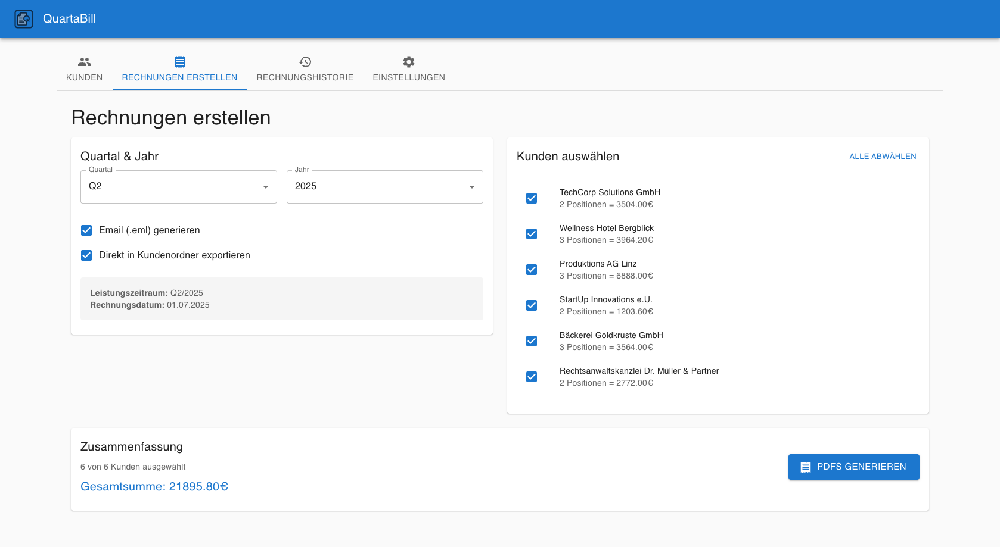

#### Rechnungserstellung
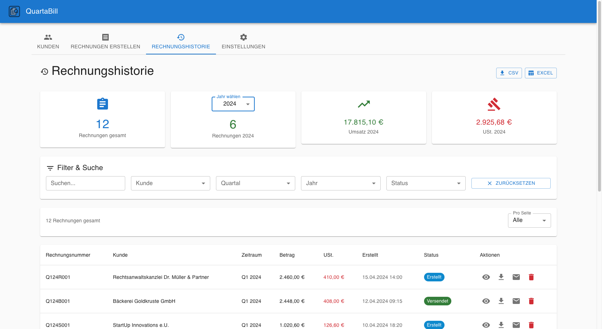

#### Rechnungshistorie mit Pagination
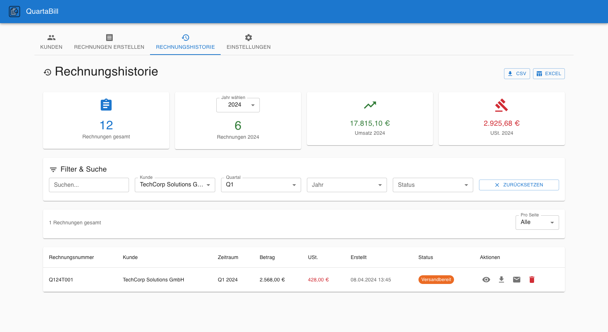

#### Einstellungen & Konfiguration
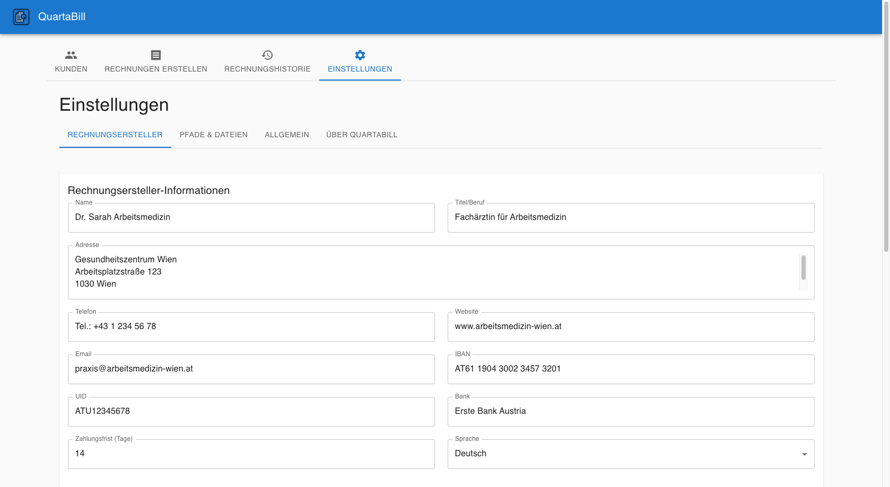

#### Backup & Datenverwaltung
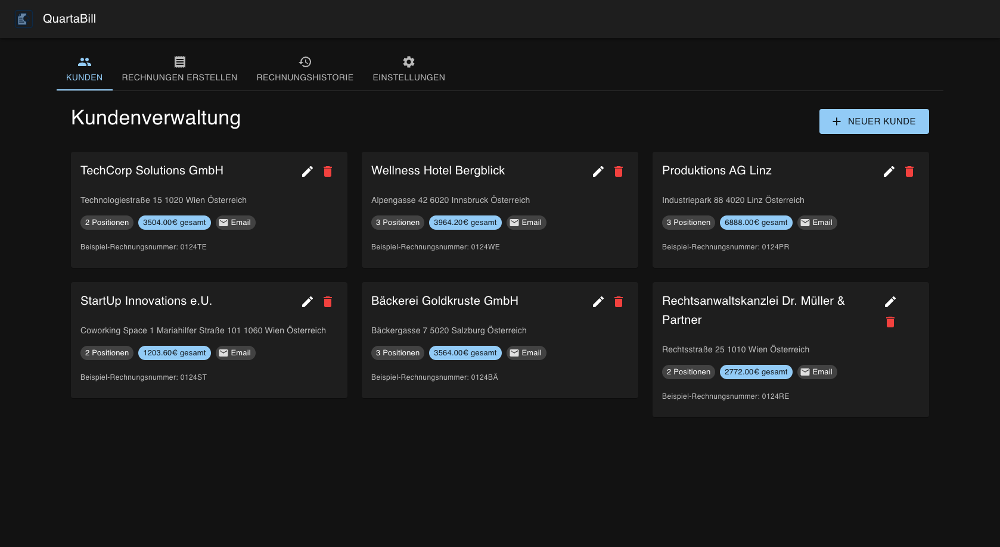

#### Beispiel-Rechnung (PDF-Ausgabe)
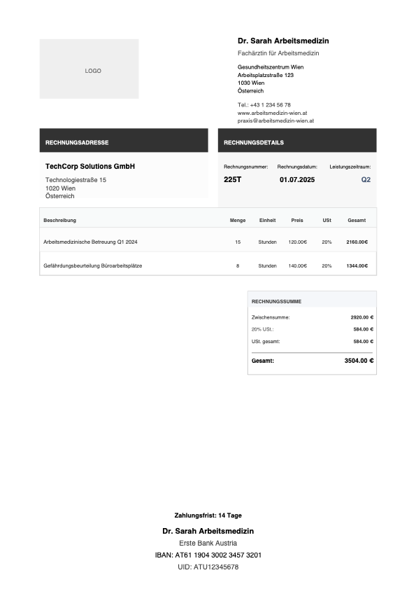

</details>

### 🇺🇸 English Version

<details>
<summary><strong>📱 Show User Interface</strong></summary>

#### Main Screen & Navigation
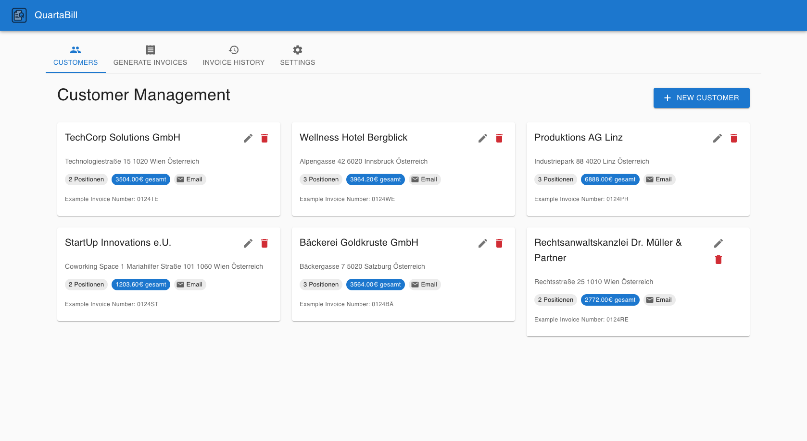

#### Customer Management
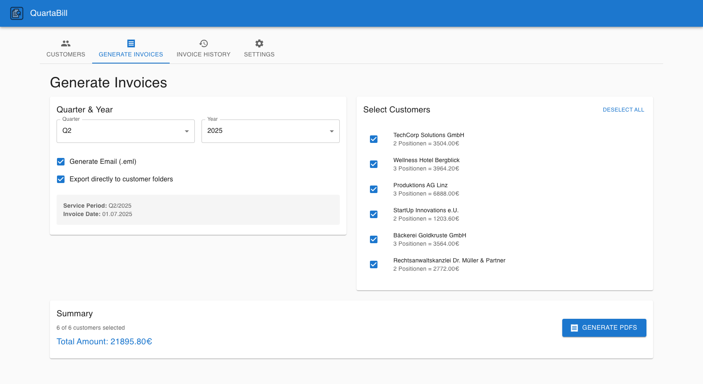

#### Invoice Generation
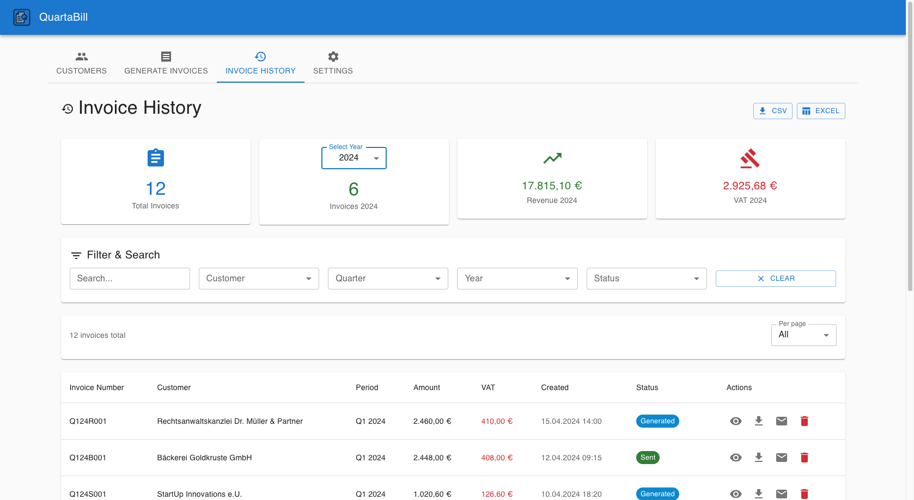

#### Invoice History with Pagination
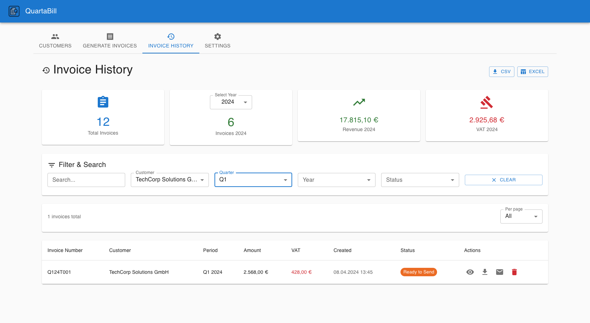

#### Settings & Configuration
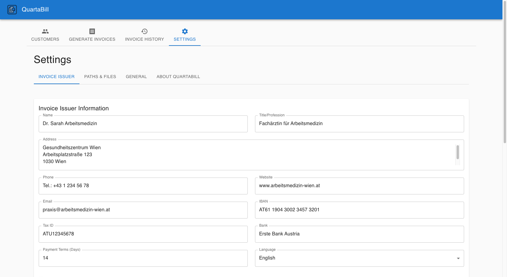

#### Backup & Data Management
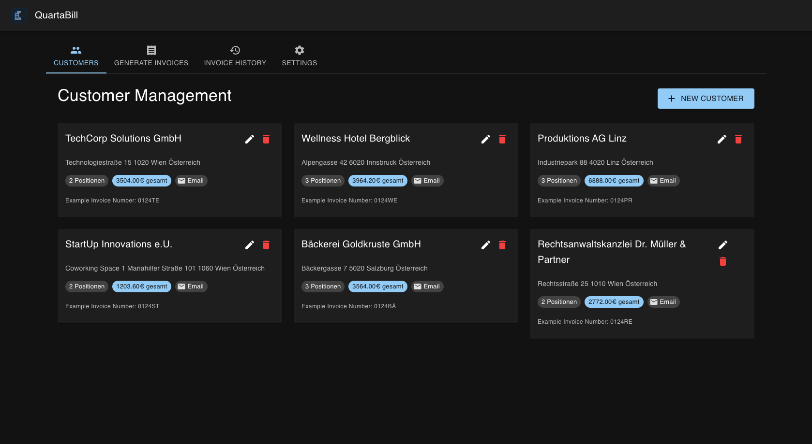

</details>

---

## ✨ Features im Detail

### 🏢 **Kundenverwaltung**
- **Vollständige Kundendaten**: Name, Adresse, Kontaktdaten, E-Mail
- **Flexible Leistungspositionen**: Verschiedene Services mit individuellen Stundensätzen
- **Drag-and-Drop Sortierung**: Einfache Neuanordnung der Leistungen
- **Deutsche Steuersätze**: 0%, 7%, 19%, 20% oder 90%@20% + 10%@0%
- **E-Mail-Templates**: Personalisierte Nachrichten mit Variablen wie `[Kunde]`, `[Quartal]`, `[Rechnungsnummer]`
- **Multi-Platform Pfade**: Separate Speicherorte für Windows, macOS und Linux

### 📊 **Rechnungserstellung**
- **Batch-Generierung**: Alle Kunden eines Quartals automatisch
- **Anpassbare Rechnungsnummern**: Format `{QQ}{YY}{KK}` → `0124EC`
- **Deutsche Steuerberechnung**: Automatisch korrekter 90%/10%-Split
- **Quartalsweise Datierung**: Automatisch korrekte Rechnungsdaten
- **Logo-Integration**: Unterstützung für PNG/JPG-Firmenlogos

### 🎨 **PDF-Ausgabe**
- **Modernes Design**: Sauberes, professionelles Layout
- **Responsive Tabellen**: Automatische Anpassung bei vielen Leistungspositionen
- **Deutsche Formatierung**: Währung, Datum, Steuersätze
- **A4-Format**: Druckoptimiert mit professionellen Schriftarten
- **Mehrseitige Rechnungen**: Automatisches Seitenwechsel bei großen Tabellen

### 📧 **E-Mail Integration**
- **Automatische EML-Generierung**: RFC-konforme E-Mail-Dateien
- **PDF-Anhang**: Sichere Base64-kodierte Übertragung
- **Personalisierte Betreffzeilen**: Mit Rechnungsnummer und Quartal
- **Platform-übergreifend**: Funktioniert mit jedem E-Mail-Programm

### ⚙️ **Konfiguration & Einstellungen**
- **Vollständige Firmendaten**: Rechnungsersteller-Informationen
- **Mehrsprachigkeit**: Deutsch/Englisch mit i18next
- **Dark/Light Mode**: Moderne Themes
- **Flexible Datenpfade**: Cloud-Sync kompatibel
- **Logo-Management**: Separate Pfade für verschiedene Betriebssysteme

### 💾 **Datenverwaltung**
- **Lokale Speicherung**: Alle Daten bleiben auf Ihrem Gerät
- **JSON-Format**: Einfache, lesbare Datenstruktur
- **Cloud-Sync ready**: Nahtlose Integration mit Cloud-Diensten
- **Backup & Restore**: Automatische Backups mit Wiederherstellungsfunktion
- **CSV-Export**: Excel-kompatible Datenexporte

---

## 🔧 Installation & Setup

### 📦 Downloads

**Aktuelle Version: v1.6.2**

Die neuesten Releases finden Sie unter [**GitHub Releases**](https://github.com/entttom/QuartaBill/releases).

#### Windows
- `QuartaBill Setup 1.6.2.exe` - Installer
- `QuartaBill 1.6.2.exe` - Portable Version

#### macOS ✅ **Vollständig signiert & notarisiert**
- `QuartaBill-1.6.2.dmg` - Intel Macs
- `QuartaBill-1.6.2-arm64.dmg` - Apple Silicon (M1/M2/M3)

#### Linux
- `QuartaBill-1.6.2.AppImage` - Universal
- `quartabill_1.6.2_amd64.deb` - Debian/Ubuntu
- `quartabill-1.6.2.x86_64.rpm` - Red Hat/Fedora

### 🚀 Erste Schritte

1. **Installation:**
   - **macOS**: `.dmg` mounten und App in Programme-Ordner ziehen
   - **Windows**: `.exe` Installer ausführen
   - **Linux**: `.AppImage` ausführbar machen oder Paket installieren

2. **Erster Start:**
   - Beim ersten Start startet das Onboarding automatisch
   - Folgen Sie den Schritten zur Grundkonfiguration

3. **Konfiguration:**
   - **Einstellungen** → **Rechnungsersteller**: Firmendaten eingeben
   - **Einstellungen** → **Pfade & Dateien**: Logo- und Speicherpfade konfigurieren
   - **Kundenverwaltung**: Erste Kunden anlegen

---

## 🛠️ Für Entwickler

### Voraussetzungen
- Node.js 18 oder höher
- npm

### Development Setup
```bash
git clone https://github.com/entttom/QuartaBill.git
cd QuartaBill
npm install
```

### Development Server
```bash
npm start          # React Development Server
npm run electron   # Electron App starten
```

### Builds erstellen
```bash
npm run dist       # Alle Plattformen
npm run dist:win   # Windows
npm run dist:mac   # macOS
npm run dist:linux # Linux
```

### 🏗️ CI/CD Pipeline

Das Projekt nutzt GitHub Actions für vollständig automatisierte Builds:

- **Push/PR**: Automatische Builds für alle Plattformen
- **Git Tags (v\*)**: Automatische Releases mit signierten Builds
- **macOS**: Vollständige Apple Developer ID Signierung und Notarisierung
- **Windows**: Code Signing geplant

**Release erstellen:**
```bash
git tag v1.6.3
git push origin v1.6.3
```

---

## 🛠️ Technischer Stack

- **Frontend**: React 18, Material-UI 5
- **Desktop**: Electron 25
- **PDF-Generierung**: jsPDF 2.5
- **Internationalisierung**: i18next
- **Auto-Updates**: electron-updater
- **Build-System**: electron-builder
- **CI/CD**: GitHub Actions
- **Code Signing**: Apple Developer ID (macOS)

---

## 📋 Systemanforderungen

| Betriebssystem | Mindestversion | Architektur |
|----------------|----------------|-------------|
| **Windows** | Windows 10 | x64 |
| **macOS** | macOS 10.14 (Mojave) | Intel & Apple Silicon |
| **Linux** | Ubuntu 18.04 (oder äquivalent) | x64 |

---

## 🔒 Sicherheit & Vertrauen

### macOS
- ✅ **Vollständig signiert**: Apple Developer ID Application
- ✅ **Notarisiert**: Von Apple verifiziert
- ✅ **Gatekeeper-kompatibel**: Keine Sicherheitswarnungen
- ✅ **Deep Code Signing**: Alle Electron Framework-Komponenten signiert

### Windows
- ⏳ **Code Signing geplant**: Authenticode-Signierung in Entwicklung

### Datenschutz
- 🔐 **Lokale Daten**: Alle Daten bleiben auf Ihrem Gerät
- 🚫 **Keine Telemetrie**: Keine Datenerfassung oder -übertragung
- 💾 **Ihre Kontrolle**: Vollständige Kontrolle über Speicherorte

---

## 📝 Changelog

Alle wichtigen Änderungen werden in der [CHANGELOG.md](CHANGELOG.md) dokumentiert.

### 🆕 Highlights der aktuellen Version (1.6.2)

- **🎨 QuartaBill Logo Integration**: Professionelles Logo im Header für bessere Markenidentität
- **📸 Screenshot-Funktionalität**: Erstellen Sie Screenshots der gesamten Anwendung mit Cmd+Shift+S
- **📄 Erweiterte Pagination**: Intelligente Seitennavigation in der Rechnungshistorie (30 Rechnungen pro Seite)
- **🔧 Konfigurierbare Seitengröße**: Wählen Sie zwischen 10, 20, 30, 50, 100 oder "Alle anzeigen"
- **🌍 Vollständige Internationalisierung**: Perfekte englische Übersetzung aller PDF-Elemente und UI-Komponenten
- **📊 Umfangreiche Dummy-Daten**: Realistische Testdaten für Screenshots und Entwicklung

---

## 🤝 Support & Community

- **Issues**: [GitHub Issues](https://github.com/entttom/QuartaBill/issues)
- **Discussions**: [GitHub Discussions](https://github.com/entttom/QuartaBill/discussions)
- **E-Mail**: tom@entner.org

---

## 📄 Lizenz

Dieses Projekt steht unter der MIT-Lizenz. Siehe [LICENSE](LICENSE) für Details.

---

<p align="center">
  Entwickelt mit ❤️ für die Arbeitsmedizin
</p>

<p align="center">
  <strong>QuartaBill</strong> - Einfach. Professionell. Zuverlässig.
</p> 